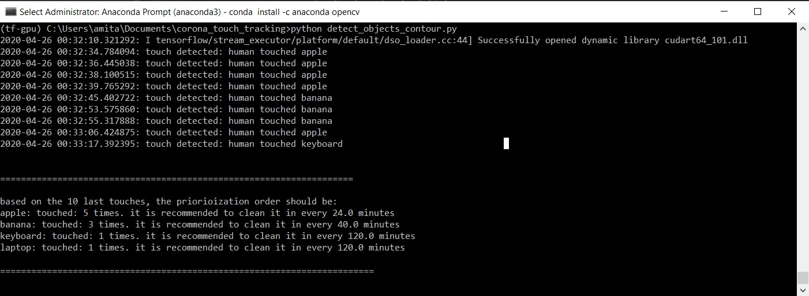

# corona touch tracking
A system that will track touch in common surfaces in order to prioriotize the cleaning/disinfection of the most touched surfaces

## manual
type `python detect_objects_countour.py` in command line 
(you have to make sure all the libraries are installed properly, including cvlib and cv2, you might want to use `anaconda`)

## contributions
contributions are very welcomed!
It is recommend to filter the issues by the "first good issue" tag. this way you can start with a relatively easy tasks
